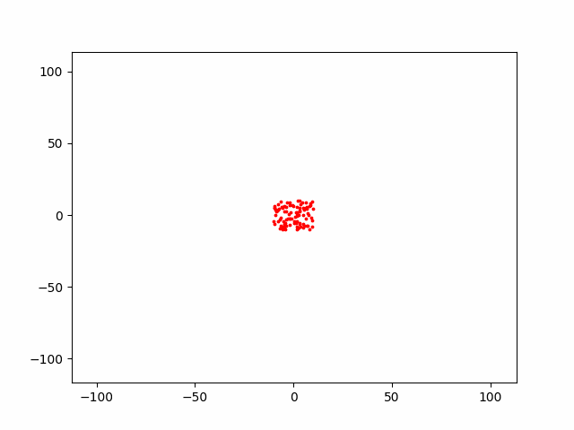

# Parallel programming lab #1 (N Body problem)

## Build:
```
cmake -B build . && cmake --build build
```
or
```
mkdir build
gcc main.c n_body.c -O3 -std=c11 -lm -o ./build/n_body -lm
```

## Run:

### 1. Generate some input with [generate_input.py](generate_input.py)
```
python generate_input.py [options] <number_of_bodies>
```
Supports following options:
```
$ python3 generate_input.py --help
usage: generate_input.py [-h] [--output OUTFILE] [-mmin MMIN] [-mmax MMAX] [-xmin XMIN] [-xmax XMAX] [-ymin YMIN] [-ymax YMAX] [-vxmin VXMIN] [-vxmax VXMAX] [-vymin VYMIN] [-vymax VYMAX] n

positional arguments:
  n                     Number of bodies to generate

options:
  -h, --help            show this help message and exit
  --output OUTFILE, -o OUTFILE
                        Output file name (default="input.txt")
  -mmin MMIN            Minimum mass for body (default=10000.0)
  -mmax MMAX            Maximum mass for body (default=50000.0)
  -xmin XMIN            Minimum x position for body (default=-10.0)
  -xmax XMAX            Maximum x position for body (default=10.0)
  -ymin YMIN            Minimum y position for body (default=-10.0)
  -ymax YMAX            Maximum y position for body (default=10.0)
  -vxmin VXMIN          Minimum speed projection on x for body (default=-5.0)
  -vxmax VXMAX          Maximum speed projection on x for body (default=5.0)
  -vymin VYMIN          Minimum speed projection on y for body (default=-5.0)
  -vymax VYMAX          Maximum speed projection on y for body (default=5.0)
```

### 2. Run program

```
./build/n_body [options] <input_filename>
```
Supports following options:
```
$ ./build/n_body
Usage: ./n_body [options] input_filename

Options:
        -j  n_threads           number of threads to run (default = 4)
        -dt time_delta          the amount by which time changes on each computation step (default = 0.1)
        -i  iterations          number of iterations to run (default = 100)
        --no-collision          disables collision between bodies
        -o  filename            specify output file (default = stdout)
```

### 3. Generate .gif via [vis.py](vis.py)
```
python vis.py <filename>
```



## Some performance results:
### Config:
- CPU: 6 cores / 12 threads
- Iterations: 100
- GCC 12.1, -O3
```
./build/n_body input.txt -j <threads> -o output.txt -i 100
```

| j \ n | 100       | 1000      | 10000      | 100000 |
|-------|-----------|-----------|------------|--------|
| 1     | 0.013084s | 0.398866s | 35.486590s | 58m    |
| 2     | 0.019285s | 0.286010s | 21.111205s | 34m    |
| 4     | 0.023142s | 0.218508s | 14.133166s | 19m    |
| 8     | 0.042478s | 0.186588s | 10.459349s | 14m    |
| 12    | 0.052489s | 0.205684s | 9.948405s  | 13.5m  |
| 16    | 0.061952s | 0.193315s | 10.260476s | 14m    |
| 20    | 0.087346s | 0.199334s | 10.319475s | 14m    |